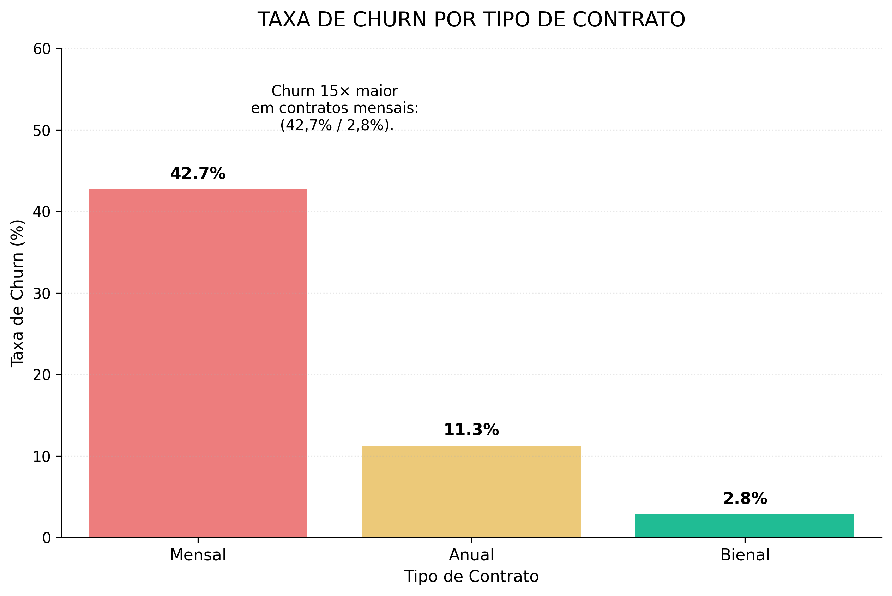
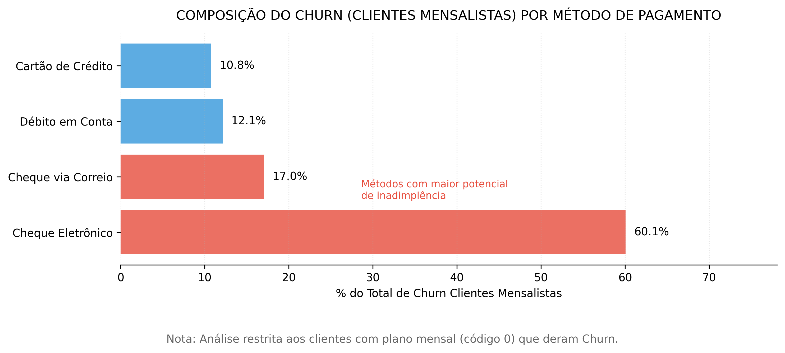

# 📊 Análise de Churn - Telecom X

**Objetivo**: Analisar os dados de clientes da Telecom X para identificar padrões e fatores que influenciam o churn (cancelamento de serviços), com o objetivo de reduzir a taxa atual de **26,6%**.

---

## 📁 Dados Utilizados
- **Fonte**: `TelecomX_Data.json`
- **Período**: Não informado
- **Tamanho da amostra**: 7.032 clientes
- **Variáveis**: 21 colunas (dados demográficos, contratos e serviços)

---

## 🔍 Principais Insights

### 📉 1. Taxa Geral de Churn
- **26,6%** dos clientes cancelaram seus serviços (destacado no gráfico `taxa_churn.png`).

### ⚠️ 2. Fatores Críticos Identificados
- **Tipo de Contrato**: Clientes com contratos mensais apresentam **15 vezes mais churn** que os com contratos bienais.
- **Tempo de Cliente**: **55,5%** dos cancelamentos ocorrem nos primeiros 12 meses.
- **Método de Pagamento**: **77%** dos clientes mensalistas que cancelam usam **pagamento por cheque**.
- **Custo Diário**: Clientes que cancelam têm um custo médio **21,6% maior** que os que permanecem.

---

## 🛠️ Metodologia

### ETL (Extração, Transformação e Carga)
- Remoção de dados nulos e duplicados.
- Padronização e transformação de variáveis.
  - Exemplo: conversão de `Churn` em variável binária `target_churn`.

### Análise
- Estatística descritiva.
- Visualizações com **Matplotlib** e **Seaborn**.

---

## 📂 Estrutura do Projeto

```
/TelecomX-ETL
├── /data
│   ├── raw/TelecomX_Data.JSON        # Dados brutos.
│   └── processed/dados_final.csv     # Dados tratados.
├── /notebooks
│ └── Analise_Churn_TelecomX.ipynb    # Análise exploratória e modelagem
├── /reports                          # Relatórios e gráficos (ex: churn_taxa_periodo.png).
├── README.md                         # Este arquivo.
├── requirements.txt                  # Bibliotecas necessárias.
└── dicionario_tecnico.md             # Dicionário de dados utilizado.
```

---

## 🚀 Como Executar

1. Clone o repositório:
   ```bash
   git clone https://github.com/MarcosKyko/TelecomX-ETL.git
   ```

2. Instale as dependências:
    ```bash
    pip install -r requirements.txt
    ```

3. Execute o notebook principal:
    ```bash
    jupyter notebook notebooks/Analise_Churn_TelecomX.ipynb
    ```

---

📊 Resultados


### 1. Taxa de Churn por Tipo de Contrato  
  
*Clientes mensais têm 15x mais churn que bienais (42,7% vs 2,8%)* 

### 2. Método de Pagamento dos Cancelamentos  
  
*77% usam cheque eletrônico (57,3% do churn total)*  

---

📝 Licença
Este projeto está licenciado sob a MIT License.

🙋‍♂️ Autor

**Marcos Antonio dos Santos**  
[](https://github.com/MarcosKyko)  